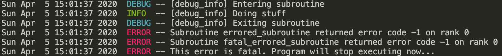

# Fortran Logger
 
 This library is still under development. 

[](https://travis-ci.com/ShatrovOA/Fortran-Logger)

## Main features
- Free and Open Source Project
- MPI Support
- Fortran 2008+ standard compliant
- Support of 4 logging levels
- CLI Support for runtime change of logging level

## Installation
The only currently possible way to install library is with [FoBiS.py](https://github.com/szaghi/FoBiS). 

### Supported build modes
#### Static libraries
- static-gnu
- static-gnu-mpi
- static-gnu-debug
- static-gnu-mpi-debug
- static-intel
- static-intel-mpi
- static-intel-debug
- static-intel-mpi-debug
#### Shared libraries
- shared-gnu
- shared-gnu-mpi
- shared-gnu-debug
- shared-gnu-mpi-debug
- shared-intel
- shared-intel-mpi
- shared-intel-debug
- shared-intel-mpi-debug


```bash
git clone https://github.com/ShatrovOA/Fortran-Logger
cd Fortran-Logger
FoBiS.py build -mode static-gnu-mpi
```

## Examples

```fortran
use fortran_logger, only : fortran_logger_t
  type(fortran_logger_t) :: logger
  integer(I4P) :: error

  call logger%initialize(log_level = 4, print_timestamp = .true.)

  call debug_info(logger)

  ! Calling external subroutine, which generates non-zero error code
  call errored_subroutine(error)
  call logger%check_error(check_routine = 'errored_subroutine', err = error)

  ! Let's call the same subroutine, but this time non-zero code will be fatal
  call errored_subroutine(error)
  call logger%check_error(check_routine = 'fatal_errored_subroutine', err = error, is_fatal = .true.)

  call logger%info(message = 'Finished')

  call logger%finalize()
```

This example will produce the following output:


```fortran
use fortran_logger, only : fortran_logger_t
  type(fortran_logger_t) :: logger
  integer(I4P) :: error

  ! MPI_Init must be called before logger%initialize. Otherwise runtime error will occur
  call MPI_Init()

  call logger%initialize(log_level = 4, print_timestamp = .true.)

  call debug_info(logger)

  ! Calling external subroutine, which generates non-zero error code
  call errored_subroutine(error)
  call logger%check_error(check_routine = 'errored_subroutine', err = error)

  ! Let's call the same subroutine, but this time non-zero code will be fatal
  call errored_subroutine(error)
  call logger%check_error(check_routine = 'fatal_errored_subroutine', err = error, is_fatal = .true.)
    
  call logger%info(message = 'Finished')
    
  call logger%finalize()

  call MPI_Finalize()
```




