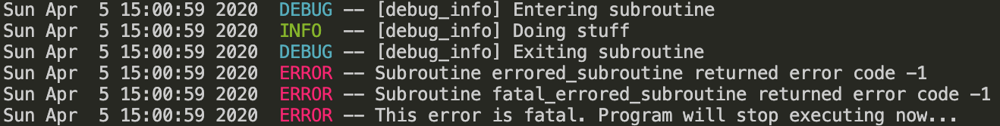

# Fortran Logger
 
 This library is still under development. 


## Main features
- Free and Open Source Project
- MPI Support
- Fortran 2008+ standard compliant

## Example of usage

```fortran
use fortran_logger_m, only : fortran_logger
implicit none
  type(fortran_logger) :: logger

  call logger%initialize(log_level = 4, print_timestamp = .true.)

  call logger%debug(routine = 'test_routine 1', message = 'enter')

  call logger%info(routine = 'test_routine 1', message = 'doing some stuff')

  call logger%warn(routine = 'test_routine 1', message = "you can't do that")

  ierror = -1
  call logger%check_error(check_routine = 'external subroutine', err = ierror, is_fatal = .true.)

  call logger%finalize()
```

This example will produce the following output:

